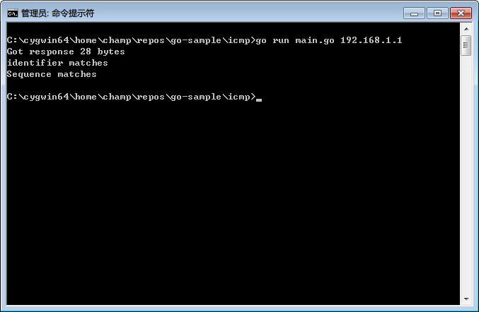
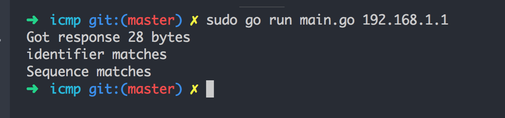
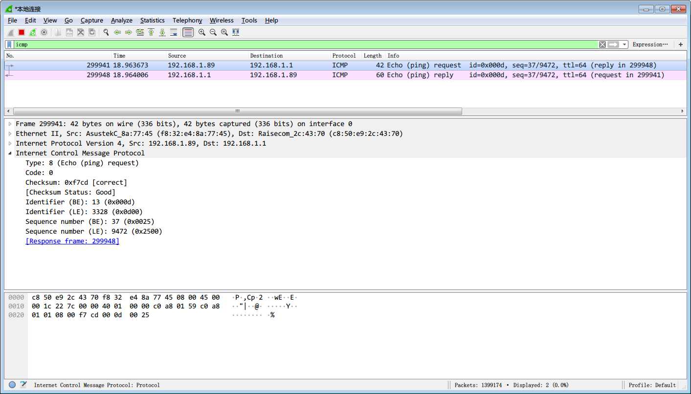
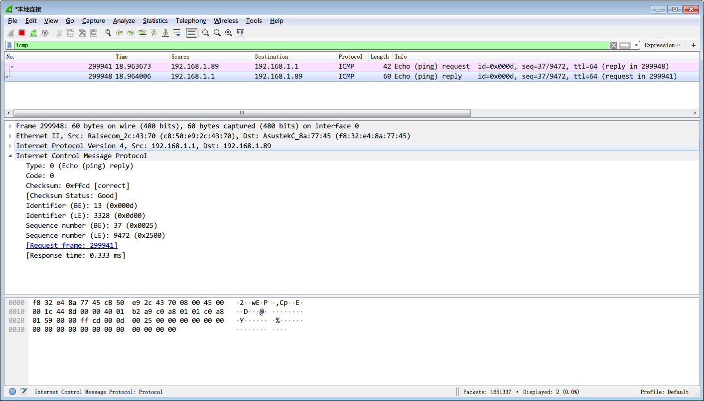
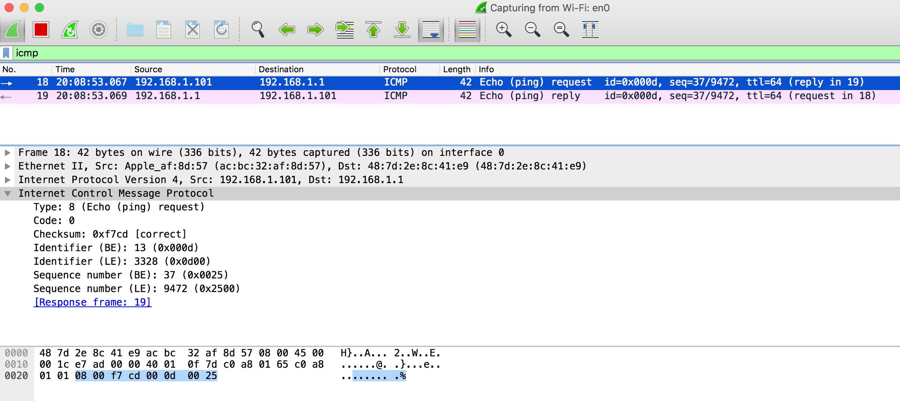
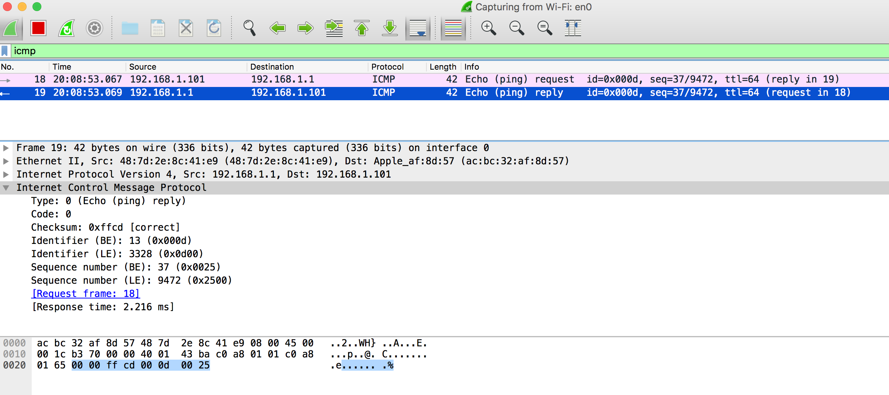

# go-sample

本项目用于收集一些常用的go代码段，以及自己写的一些代码样例

- [spinner](./spinner) 命令行下面常见的等待动画
- [icmp](./icmp) 实现了icmp协议的echo操作(ping命令)


## icmp

### 1. create raw socket
```golang
conn, err := net.DialIP("ip4:icmp", nil, addr)
```


### 2. construct packet
```golang
var msg [512]byte
msg[0] = 8    // type
msg[1] = 0    // code
msg[2] = 0xf7 // checksum, fix later, 此处直接使用正确的checksum
msg[3] = 0xcd // checksume, fix later, 此处直接使用正确的checksum
msg[4] = 0    // identifier[0]
msg[5] = 13   // identifier[1]
msg[6] = 0    // sequence[0]
msg[7] = 37   // sequence[1]
```


### 3. send and receive
```golang
_, err := conn.Write(msg[0:len])
_, err := conn.Read(msg[0:])
```

### 4. test result
```golang
if n >= 8 {
    n -= 8
}
	
if msg[n+5] == 13 {
    fmt.Println("identifier matches")
}
if msg[n+7] == 37 {
    fmt.Println("Sequence matches")
}
```

### 5. run snapshot
win:


mac:



### 6. wiresharp snapshot
win:



mac:



